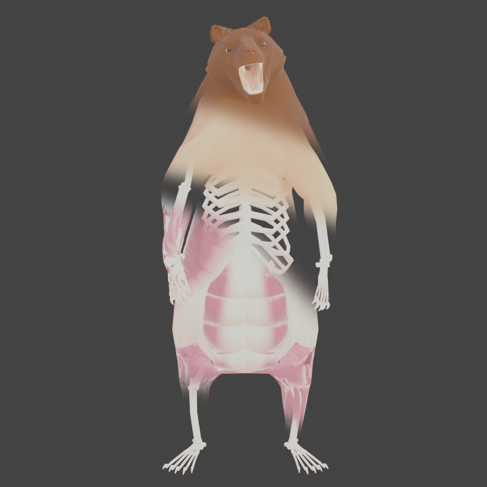
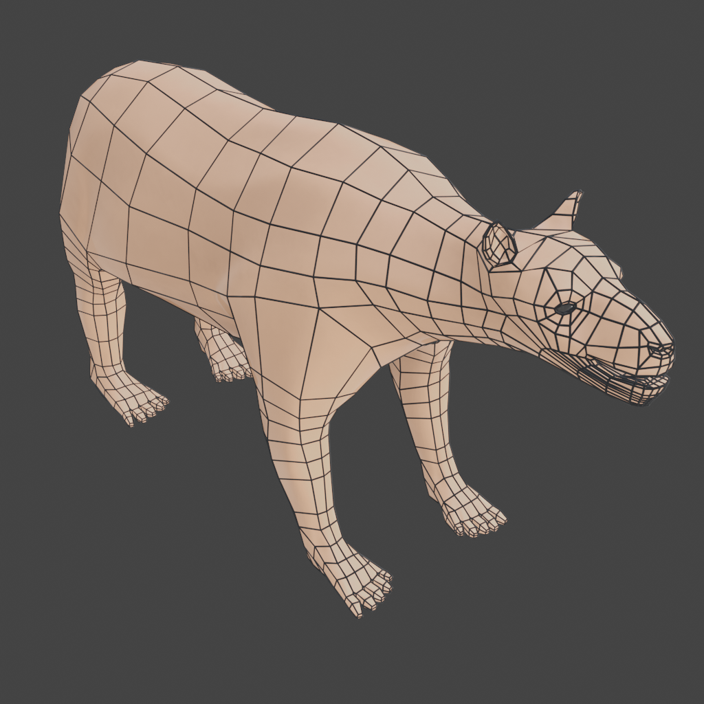

# 3D Artwork

## Wasteland RPG Character Assets
=== "Facial Expressions"

    

    === "Face 1"
    
        
   
    === "Face 2"
    
        

    === "Face 3"
    
        

    !!! quote "About"

        This character model was designed for use in a game where NPC interaction was considered very important. The character model is able to give a range of expressions using both facial bone and blend shape animation.
    

=== "Topology"

    

    === "Face"
    
        
   
    === "Hand"
    
        

    === "Hand (Back)"
    
        

    === "Full"
    
        

    !!! quote "About"

        Topological showcase, this model is one of the higher poly models I've created.
    

=== "Poses"

    

    === "T-Pose"
    
        
   
    === "Collage"
    
        

    !!! quote "About"

        The base t-pose along with a collage of 32 other poses.
    

## Anatomical Humanoid
=== "Layers"
    

    === "Skeleton"
    
        
   
    === "Muscle"
    
        

    === "Body"
    
        

    !!! quote "About"

        This model was made for a fantasy RPG I planned to develop. As you can see there are three main layers to this model: the skeleton layer, muscle layer, and body layer.
    

=== "Topology"

    

    === "Face"
    
        
   
    === "Hand"
    
        

    === "Torso"
    
        

    !!! quote "About"

        Here's a showcase of the topology, as you can see it's very low-poly which makes for quite good performance in-engine.
    

=== "Layer Animation"

    

    
    !!! quote "About"

        A quick showcase of the running animation with all layers.

## Anatomical Bear
=== "Layers"
    

    === "Skeleton"
    
        
   
    === "Muscle"
    
        

    === "Body"
    
        

    !!! quote "About"

        Another model created for the fantasy RPG mentioned in the previous section. This one has one extra layer to represent both the skin and the fur of the bear.
    

=== "Poses"

    

    === "Stride"
    
        
   
    === "Stride (Layers)"
    
        

    === "Stand"
    
        

    === "Stand (Layers)"
    
        

    !!! quote "About"

        Here's two images of poses with their layer-separated versions.
    

=== "Topology"

    

    === "Face"
    
        
   
    === "Body"
    
        

    !!! quote "About"

        Topology of the anatomical bear model. This is another low poly model and has even less polygons than the anatomical humanoid.
    

## Cartoony Character Assets
=== "Base Pose"

    

    

    !!! quote "About"

        A cartoony character model for use in game engines, the triangle count is very low (less than 4 thousand).
    

=== "Facial Expressions"

    

    === "Face 1"
    
        
   
    === "Face 2"
    
        

    === "Face3"
    
        

    !!! quote "About"

        I'm very happy with the overall look of the model, especially in the face. I'd never really experimented with unlit shading before this point and it gave me a lot more artistic freedom when representing the shading. For how low the poly count is, the facial expressions look quite good, I think this is one of the most polished models I've made.
    

=== "Topology"

    

    === "Torso"
    
        
   
    === "Face"
    
        

    !!! quote "About"

        Topology of the model.
    
