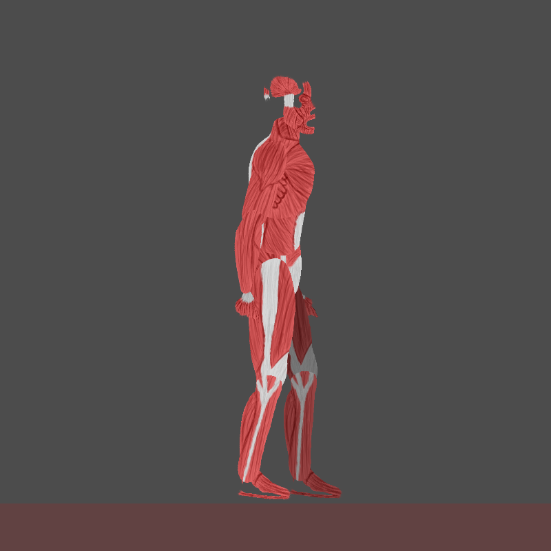
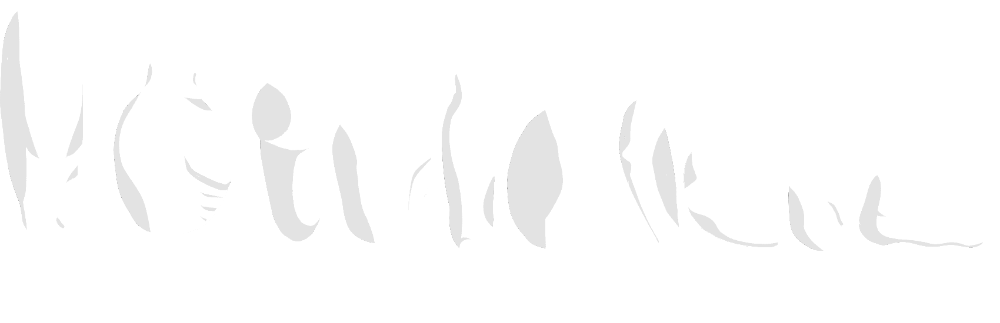

# 2D Artwork

## Pastel Platformer Assets
=== "Variations"
    

    === "Variation 1"
    
        
   
    === "Variation 2"
    
        

    === "Variation 3"
    
        

    !!! quote "About"

        2D character sprites for a sci-fi themed platformer. On the left you can see the base model, the middle is the model with full clothes (clothing was made swappable in the Godot game engine), and on the right you can see the muscle variation.
    

=== "Video"

    

    !!! quote "About"
    
        An example of how the assets were used in the prototyping of a 2D platformer project, this video showcases new assets aswell as different combinations of clothes and animations.

=== "Spritesheet"

    { align=center }

    !!! quote "About"
    
        The constituent sprites of the stylized character model, labelled by which body part they represent.

## Modular Pixel Art Character
=== "Customization"
    

    !!! quote "About"
    
        I created this character customization system for a zombie survival game. This project was specifically done with pixel art, which made the process of asset development much quicker.