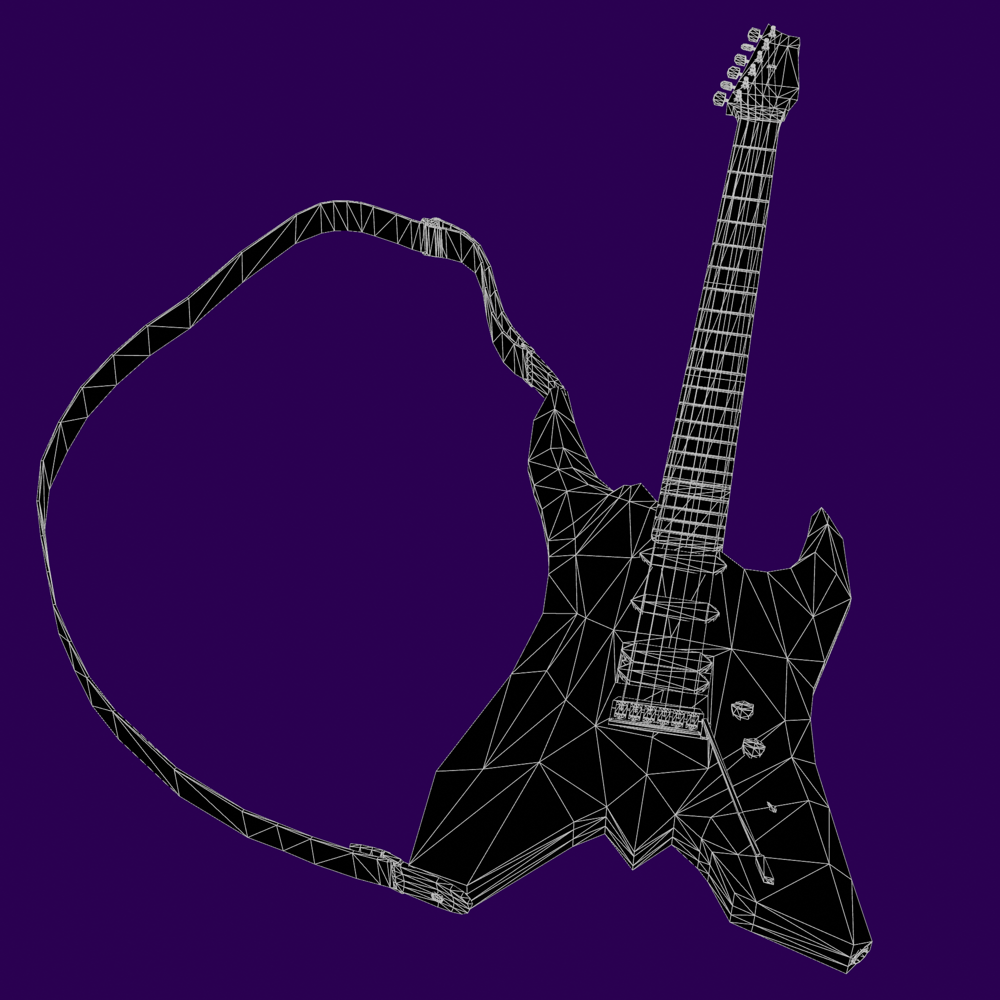

# 3D Artwork

## Stylized "Brushed" Humanoid
=== "Facial Expressions"

    

    === "Default"
    
        
   
    === "Surprised"
    
        

    === "Smile"
    
        
    
    === "Smug"
    
        
    
    === "Angry"
    
        
    
    === "Grumpy"
    
        
    
    === "Hairless"
    
        

    !!! quote "About"

        One of my most recent and favorite character models. This humanoid was designed for a CRPG project of mine. I'd painted over the normal maps to create a subtle "brushed effect". This is an early version of the game's protagonist.
    

=== "Poses"

    

    === "T-Pose"
    
        
   
    === "Arms Crossed"
    
        

    === "Chaotic"
    
        

    === "Deformation A"
    
        
    
    === "Deformation B"
    
        
    
    === "Deformation C"
    
        

    !!! quote "About"

        Here I've posed the character model in a few different ways. I was able to really refine the deformation and weight painting on this one, using the movement of multiple bones in some cases (e.g. shoulder bone and upper arm bone) to create better deformation and a more anatomically accurate pose.

        In the "Deformation" poses, you can see the ability of the model to stretch whilst maintaining good deformation.
    

=== "Topology"

    

    === "Full"
    
        
   
    === "Face"
    
        
    
    === "Face (Hairless)"
    
        
    
    === "Hand"
    
        

    !!! quote "About"

        Here's a look at the topology of the model.
    

## Stylized "Brushed" Electric Guitar
=== "Renders"

    

    === "Closeup"
    
        
   
    === "Top"
    
        

    === "Bottom"
    
        

    === "360 View"

        

    !!! quote "About"

        A stylized electric guitar model for the CRPG project mentioned earlier. All of the essential elements of a functioning electric guitar are visually represented and have accurate proportions. It is low poly and can be used in game engines.
    

=== "Topology"

    

    

    !!! quote "About"

        Subdivision surface was employed often to create the normal maps for the guitar, the topology conforms to the angles built into the design of the guitar. The triangle count for this model is 5,612. A good amount of detail was given to this prop as it will be an important and closely examined item in the game.
    

## Wasteland RPG Character Assets
=== "Facial Expressions"

    

    === "Face 1"
    
        
   
    === "Face 2"
    
        

    === "Face 3"
    
        

    !!! quote "About"

        This character model was designed for use in a game where NPC interaction was considered very important. The character model is able to give a range of expressions using both facial bone and blend shape animation.
    

=== "Topology"

    

    === "Face"
    
        
   
    === "Hand"
    
        

    === "Hand (Back)"
    
        

    === "Full"
    
        

    !!! quote "About"

        Topological showcase, this model is one of the higher poly models I've created.
    

=== "Poses"

    

    === "T-Pose"
    
        
   
    === "Collage"
    
        

    !!! quote "About"

        The base t-pose along with a collage of 32 other poses.
    

## Anatomical Humanoid
=== "Layers"
    

    === "Skeleton"
    
        
   
    === "Muscle"
    
        

    === "Body"
    
        

    !!! quote "About"

        This model was made for a fantasy RPG I planned to develop. As you can see there are three main layers to this model: the skeleton layer, muscle layer, and body layer.
    

=== "Topology"

    

    === "Face"
    
        
   
    === "Hand"
    
        

    === "Torso"
    
        

    !!! quote "About"

        Here's a showcase of the topology, as you can see it's very low-poly which makes for quite good performance in-engine.
    

=== "Layer Animation"

    

    
    !!! quote "About"

        A quick showcase of the running animation with all layers.

## Anatomical Bear
=== "Layers"
    

    === "Skeleton"
    
        
   
    === "Muscle"
    
        

    === "Body"
    
        

    !!! quote "About"

        Another model created for the fantasy RPG mentioned in the previous section. This one has one extra layer to represent both the skin and the fur of the bear.
    

=== "Poses"

    

    === "Stride"
    
        
   
    === "Stride (Layers)"
    
        

    === "Stand"
    
        

    === "Stand (Layers)"
    
        

    !!! quote "About"

        Here's two images of poses with their layer-separated versions.
    

=== "Topology"

    

    === "Face"
    
        
   
    === "Body"
    
        

    !!! quote "About"

        Topology of the anatomical bear model. This is another low poly model and has even less polygons than the anatomical humanoid.
    

## Cartoony Character Assets
=== "Base Pose"

    

    

    !!! quote "About"

        A cartoony character model for use in game engines, the triangle count is very low (less than 4 thousand).
    

=== "Facial Expressions"

    

    === "Face 1"
    
        
   
    === "Face 2"
    
        

    === "Face3"
    
        

    !!! quote "About"

        I'm very happy with the overall look of the model, especially in the face. I'd never really experimented with unlit shading before this point and it gave me a lot more artistic freedom when representing the shading. For how low the poly count is, the facial expressions look quite good, I really think I polished this one well.
    

=== "Topology"

    

    === "Torso"
    
        
   
    === "Face"
    
        

    !!! quote "About"

        Topology of the model.
    

## Modern Military Weapons
=== "Combat Knife"

    

    === "Lit"
    
        
   
    === "Wireframe"
    
        

    !!! quote "About"

        These assets were made for a Roblox military sim. They're quite low poly and have interchangable parts for in-game customization.
    

=== "Glock 17"

    

    === "Angle 1"
    
        
   
    === "Angle 2"
    
        

    === "Pieces"
    
        
    
    === "Threaded Barrel"
    
        
    
    === "Compensator"
    
        
    
    === "Suppressor"
    
        

    === "Wireframe"
    
        

    !!! quote "About"

        Here's some pictures of the Glock 17 model for the game, showcased here are some of the barrel attachments.
    

=== "9mm Round"

    

    === "Lit"
    
        
   
    === "Wireframe"
    
        

    !!! quote "About"

        A bullet to be used in the Glock 17.
    
