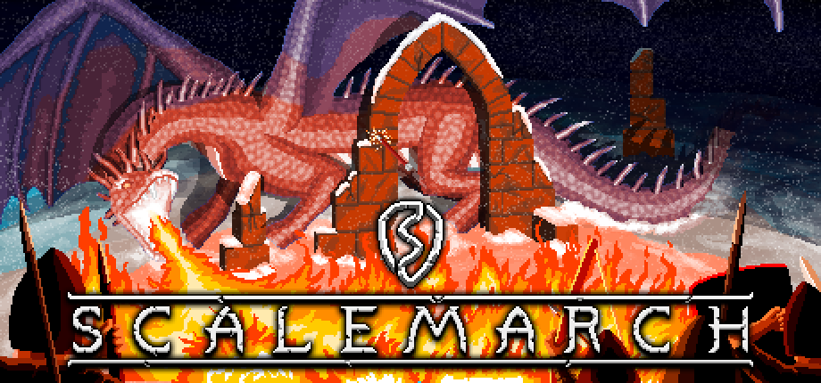

# Scalemarch
=== "About"

    

    

    !!! quote "About"

        Scalemarch is a roguelite project I've been working on where you build and play as your own dragon. The game is made with Godot and puts heavy emphasis on emergent gameplay and using the environment to your advantage.

        For more information, a link to the Steam page can be found [here](https://store.steampowered.com/app/3827550/Scalemarch/).
    

=== "Test Footage"
    

    !!! quote "About"
    
        Here's some test footage from the project which showcases the upgrade system and the arachnid enemy type.